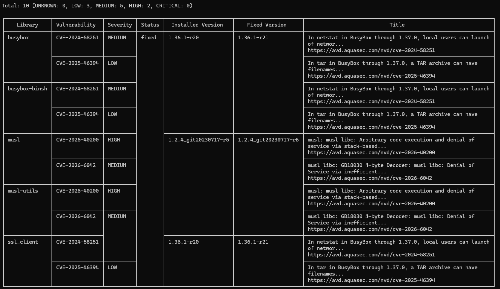
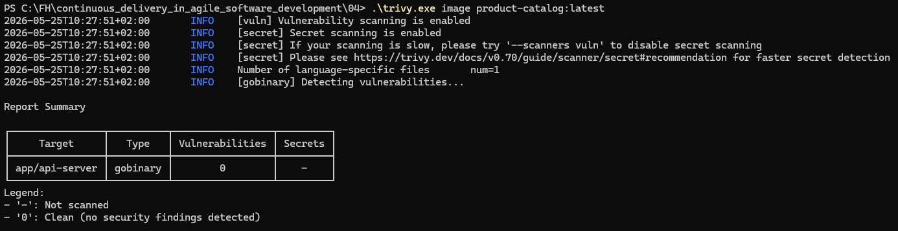
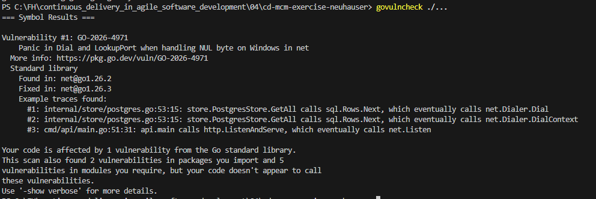
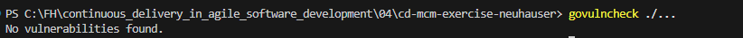

# Exercise Security K8s

## Aufgabe 1
### Trivy Ergebnis

**Vor den Verbesserungen**

Im Scann ist zu sehen, dass es 3 kleine, 5 mittlere und 2 Große Sicherheitslücken im image gibt. Dabei beeinflusst das base image für den Deploy `alpine:3.19` den Sicherheitsbereicht am Meisten. Durch das verwenden von einem anderen base image können diese Sicherheitslücken geschlossen werden.

**Mit dem Image Scratch als Baseimage**

## Aufgabe 2

### govulncheck Ergebnis

**Vor den Verbesserungen**

**Nach den Verbesserungen**

