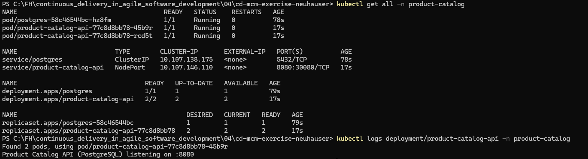
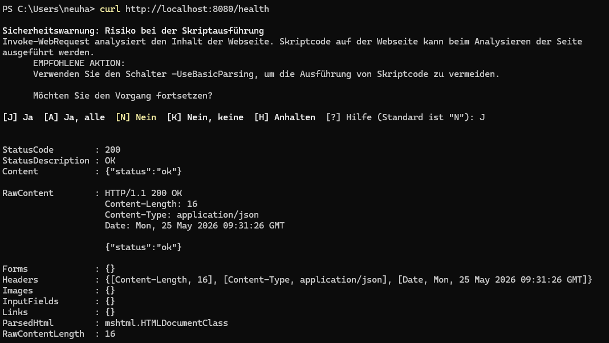
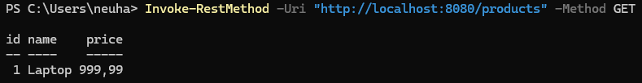
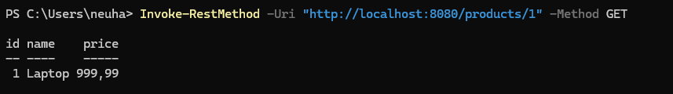
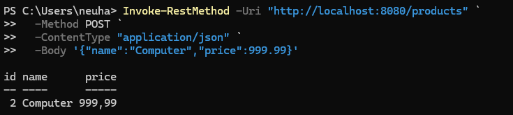
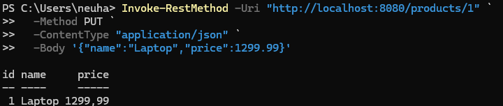
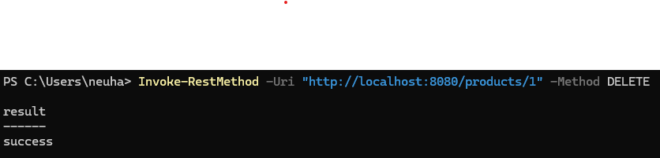

# Exercise Security K8s

**Name:** Jonas Neuhauser

**URL zum Repository:** https://github.com/Joejn/cd-mcm-exercise-neuhauser

## Aufgabe 1

### Trivy Ergebnis

**Vor den Verbesserungen**


Im Scan ist zu sehen, dass es 3 kleine, 5 mittlere und 2 große Sicherheitslücken im Image gibt. Dabei beeinflusst das Base-Image für den Deploy `alpine:3.19` den Sicherheitsbereich am meisten. Durch die Verwendung eines anderen Base-Images können diese Sicherheitslücken geschlossen werden.

**Mit dem Image Scratch als Base-Image**


## Aufgabe 2

### govulncheck Ergebnis

**Vor den Verbesserungen**


**Verbesserungen:** Die Go-Version in `go.mod` wurde auf `1.26.3` gesetzt.

**Nach den Verbesserungen**


## Aufgabe 3

### Deployment

**Logs**


**Healthcheck**


### API Calls

**Alle Produkte abfragen**

```powershell
Invoke-RestMethod -Uri "http://localhost:8080/products" -Method GET
```



**Ein Produkt abfragen**

```powershell
Invoke-RestMethod -Uri "http://localhost:8080/products/1" -Method GET
```



**Produkt erstellen**

```powershell
Invoke-RestMethod -Uri "http://localhost:8080/products" `
  -Method POST `
  -ContentType "application/json" `
  -Body '{"name":"Computer","price":999.99}'
```



**Produkt aktualisieren**

```powershell
Invoke-RestMethod -Uri "http://localhost:8080/products/1" `
  -Method PUT `
  -ContentType "application/json" `
  -Body '{"name":"Laptop","price":1299.99}'
```



**Produkt löschen**

```powershell
Invoke-RestMethod -Uri "http://localhost:8080/products/1" -Method DELETE
```



## Aufgabe 4

Lösung in K8S.md
